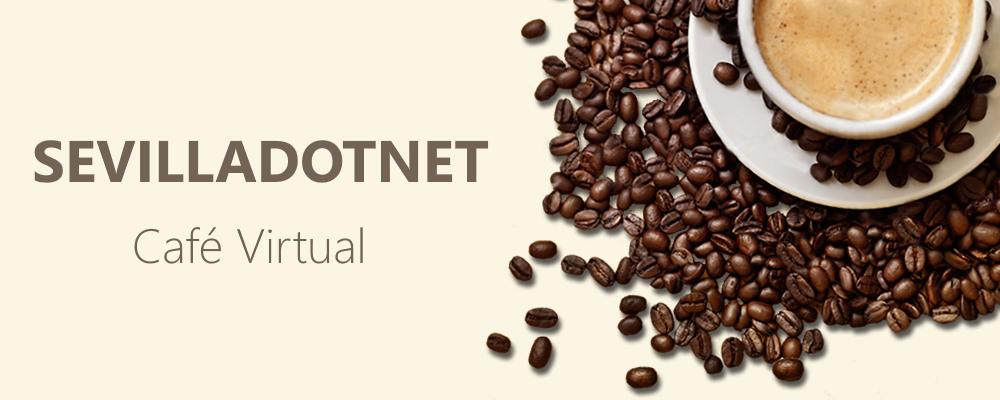

# SevillaDotNet - Café Virtual

Los cafés virtuales consisten en una reunión por streaming donde tenemos un café y charla con un invitado especial. De una forma amena y divertida hablamos con invitados acerca de tecnologías .NET, los conocemos mejor, etc. 

En este repositorio puedes encontrar la presentación y otro material usado en cada uno de los streamings.